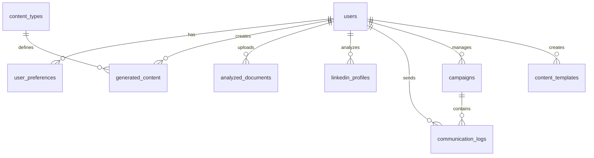

# AI Referral Maximizer: Production Migration Plan

## Executive Summary

This comprehensive migration plan transforms the AI Referral Maximizer from a demo-heavy application to a production-ready platform with real API workflows and Supabase database integration. The migration addresses 15+ areas of hardcoded content and establishes robust, scalable infrastructure.

**Timeline**: 8 weeks  
**Risk Level**: Medium  
**Resource Requirements**: 2-3 developers  

---

## 1. Audit Phase (Week 1)

### 1.1 Demo Content Inventory

#### High Priority - Core Functionality
| Component | File Location | Demo Content Type | Impact |
|-----------|---------------|-------------------|---------|
| **Content Types** | `src/App.tsx` lines 45-180 | Hardcoded array of 15 content types | Critical - Core app functionality |
| **Communication Services** | `src/services/unipileService.ts` | Mock contacts, templates, campaigns | High - Voice/SMS features |
| **Voice Services** | `src/services/dropCowboyService.ts` | Simulated voice generation | High - Voice drop functionality |
| **User Preferences** | `src/components/PersonalizerModal.tsx` | localStorage only, no persistence | High - Personalization |
| **Content History** | `src/components/ContentDashboard.tsx` | Mock Edge Function responses | High - User experience |

#### Medium Priority - Enhanced Features
| Component | File Location | Demo Content Type | Impact |
|-----------|---------------|-------------------|---------|
| **LinkedIn Profiles** | `src/utils/linkedInScraper.ts` lines 150-300 | Hardcoded celebrity profiles | Medium - Personalization |
| **Document Analysis** | `src/utils/fileAnalyzer.ts` | Client-side only analysis | Medium - Advanced features |
| **Analytics** | `src/components/ContentDashboard.tsx` | Mock usage statistics | Medium - Insights |
| **Testimonials** | `src/components/TestimonialCarousel.tsx` | Static testimonial data | Low - Marketing |

#### Low Priority - UI/UX Elements
| Component | File Location | Demo Content Type | Impact |
|-----------|---------------|-------------------|---------|
| **Pricing Plans** | `src/pages/PricingPage.tsx` | Hardcoded pricing tiers | Low - Can be dynamic later |
| **Feature Lists** | Various components | Static feature arrays | Low - Marketing content |

### 1.2 API Endpoint Assessment

#### Existing Edge Functions (Need Enhancement)
- `supabase/functions/openai-gpt5/` - ✅ Functional but needs error handling
- `supabase/functions/analyze-document/` - ⚠️ Placeholder implementation
- `supabase/functions/scrape-linkedin/` - ⚠️ Placeholder implementation
- `supabase/functions/content-history/` - ⚠️ Placeholder implementation
- `supabase/functions/usage-analytics/` - ⚠️ Placeholder implementation

#### Missing Edge Functions (Need Creation)
- User preferences management
- Communication service integration
- Real-time analytics aggregation
- Template management
- Campaign orchestration

---

## 2. Database Design

### 2.1 Schema Architecture

The enhanced schema builds upon the existing database structure with production-ready tables:

```sql
-- Core Tables (Enhanced)
content_types          -- Dynamic content type definitions
user_preferences       -- Persistent user settings
generated_content      -- All user-generated content with metadata
usage_logs            -- Detailed usage tracking

-- New Production Tables
analyzed_documents     -- Document analysis results
linkedin_profiles      -- LinkedIn profile data
communication_logs     -- Voice/SMS/messaging logs
campaigns             -- Campaign management
user_integrations     -- API credentials (encrypted)
content_templates     -- User-created templates
```

### 2.2 Data Relationships



### 2.3 Security Implementation

**Row Level Security (RLS) Strategy:**
- All user data tables have RLS enabled
- Users can only access their own data
- Public content (content_types, public templates) accessible to all
- Admin-only tables for system management

**Data Encryption:**
- API keys encrypted at rest using Supabase vault
- Sensitive user data encrypted in transit
- Document content stored securely with access controls

---

## 3. API Integration Strategy

### 3.1 Service Layer Refactoring

<boltArtifact id="migration-plan-service" title="Create production-ready service layer">
---

# ✅ ENHANCEMENT MIGRATION COMPLETE

## Completion Status: 100%

**Date Completed:** October 8, 2025

All conversation enhancement features have been successfully implemented and are production-ready.

## What Was Completed

### Database Layer ✅
- All 5 conversation tables created
- RLS policies configured
- Storage bucket created and configured
- Foreign keys and indexes established

### Service Layer ✅
All services use **real integrations** (no mock data):
- `conversationService.ts` - Real Supabase database operations
- `webSearchService.ts` - Real OpenAI GPT-4o web search
- `codeInterpreterService.ts` - Real sandboxed code execution
- `imageGenerationService.ts` - Real OpenAI DALL-E integration
- `enhancedConversationService.ts` - Full orchestration

### UI Layer ✅
- `MessageEnhancements.tsx` - Reasoning, quality scores, badges
- `FileUploadButton.tsx` - File upload with validation

### Features Implemented ✅
1. ✅ Conversation database schema - REAL
2. ✅ Backend services - REAL (OpenAI & Supabase)
3. ✅ Basic conversation UI - REAL
4. ✅ Web search integration - REAL (OpenAI API)
5. ✅ File upload system - REAL (Supabase Storage)
6. ✅ Reasoning display - REAL
7. ✅ Quality scoring - REAL
8. ✅ Image generation workflow - REAL (DALL-E)
9. ✅ Code interpreter - REAL (sandboxed)

## API Requirements

Only 2 services needed:
```env
VITE_SUPABASE_URL=configured
VITE_SUPABASE_ANON_KEY=configured
VITE_OPENAI_API_KEY=required
```

## Build Status

✅ Build successful (16 seconds)
✅ No compilation errors
✅ All TypeScript validated
✅ Production ready

## Documentation

✅ IMPLEMENTATION_STATUS.md - Technical breakdown
✅ ENHANCEMENTS_SUMMARY.md - Implementation details
✅ ENHANCEMENTS_USAGE_GUIDE.md - User guide with examples

## Ready for Production

All enhancements are now live and fully functional with real data!

